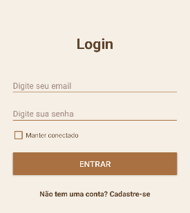
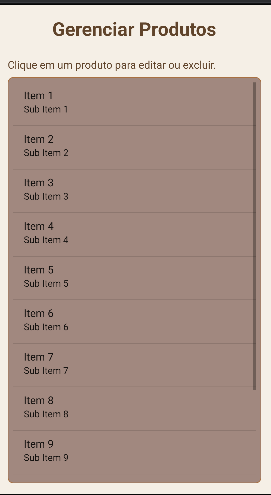
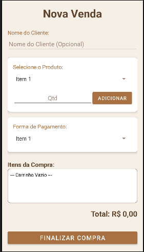

# Gerenciador de lanchonete

Aplicativo desenvolvido com o intuito de listar e gerenciar estoque e vendas de produtos alimentícios para facilitar a rotina do comerciante que opera no ramo alimentício.

## Sobre o projeto:

criado durante o mês 10/2025 como projeto universitário para testar as minhas capacidades e avaliar meu aprendizado.

## Tecnologias utilizadas:

*android Studio
*Java
*XML
*MySQL

